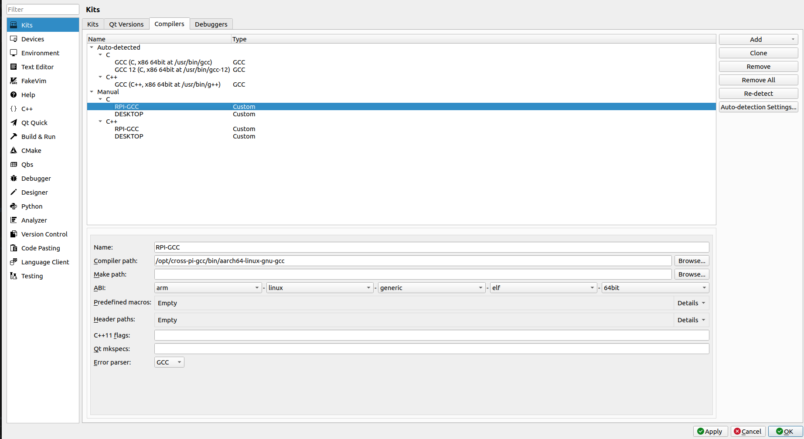
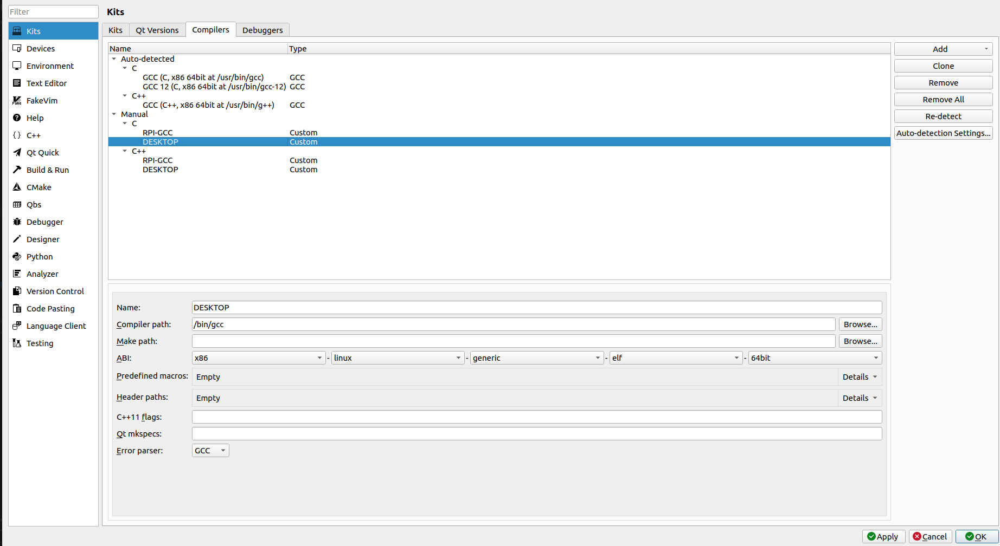
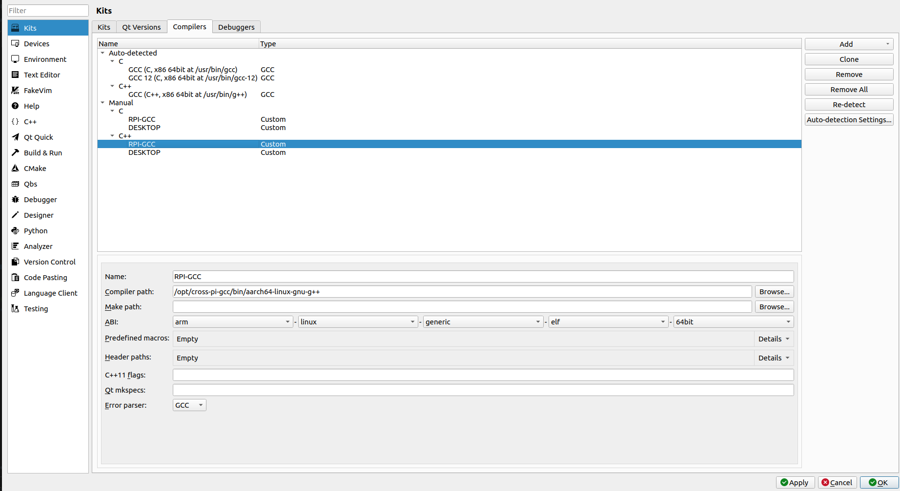
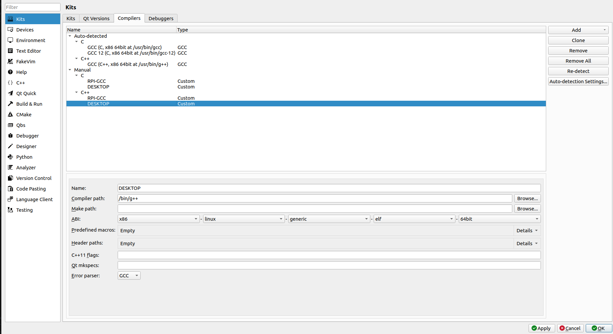

# Qt6.5.1_CrossCompile_Raspi4
Bài viết này hướng dẫn thiết lập môi trường biên dịch chéo cho Raspi 4, Pi OS 64bit

Phiên bản PiOS mình dùng là 2023-05-03-raspios-bullseye-arm64.img
Phiên bản Ubuntu mình dùng là 22.04.5 LTS


Link drive lưu 1 vài file mình sử dụng trong quá trình build, đề phòng sau này có phiên bản mới không tương thích

https://drive.google.com/drive/folders/1INfJcckDI_olr4NDbNYfu6JdJKIJMWz6?usp=sharing


# Chuẩn bị cho RPI
Cật nhập repo mới nhất
```Bash
sudo apt update
sudo apt upgrade
```
Cài các package liên quan
```Bash
sudo apt-get install libboost-all-dev libudev-dev libinput-dev libts-dev libmtdev-dev libjpeg-dev libfontconfig1-dev libssl-dev libdbus-1-dev libglib2.0-dev libxkbcommon-dev libegl1-mesa-dev libgbm-dev libgles2-mesa-dev mesa-common-dev libasound2-dev libpulse-dev gstreamer1.0-omx libgstreamer1.0-dev libgstreamer-plugins-base1.0-dev  gstreamer1.0-alsa libvpx-dev libsrtp2-dev libsnappy-dev libnss3-dev "^libxcb.*" flex bison libxslt-dev ruby gperf libbz2-dev libcups2-dev libatkmm-1.6-dev libxi6 libxcomposite1 libfreetype6-dev libicu-dev libsqlite3-dev libxslt1-dev 
```
```Bash
sudo apt-get install libavcodec-dev libavformat-dev libswscale-dev libx11-dev freetds-dev libsqlite3-dev libpq-dev libiodbc2-dev firebird-dev libxext-dev libxcb1 libxcb1-dev libx11-xcb1 libx11-xcb-dev libxcb-keysyms1 libxcb-keysyms1-dev libxcb-image0 libxcb-image0-dev libxcb-shm0 libxcb-shm0-dev libxcb-icccm4 libxcb-icccm4-dev libxcb-sync1 libxcb-sync-dev libxcb-render-util0 libxcb-render-util0-dev libxcb-xfixes0-dev libxrender-dev libxcb-shape0-dev libxcb-randr0-dev libxcb-glx0-dev libxi-dev libdrm-dev libxcb-xinerama0 libxcb-xinerama0-dev libatspi2.0-dev libxcursor-dev libxcomposite-dev libxdamage-dev libxss-dev libxtst-dev libpci-dev libcap-dev libxrandr-dev libdirectfb-dev libaudio-dev libxkbcommon-x11-dev gdbserver
```

Tạo folder chứa binaries của Qt6
```Bash
sudo mkdir /usr/local/qt6
sudo chmod 777 /usr/local/bin
```
Thêm đường dẫn thư viện 
```Bash
echo 'export LD_LIBRARY_PATH=$LD_LIBRARY_PATH:/usr/local/qt6/lib/' >> ~/.bashrc
source ~/.bashrc
```

# Chuẩn bị cho máy Host
Cập nhật repo mới nhất
```Bash
sudo apt update
sudo apt upgrade
```
Cài các gói cần thiết 
```Bash
sudo apt-get install make build-essential libclang-dev ninja-build gcc git bison python3 gperf pkg-config libfontconfig1-dev libfreetype6-dev libx11-dev libx11-xcb-dev libxext-dev libxfixes-dev libxi-dev libxrender-dev libxcb1-dev libxcb-glx0-dev libxcb-keysyms1-dev libxcb-image0-dev libxcb-shm0-dev libxcb-icccm4-dev libxcb-sync-dev libxcb-xfixes0-dev libxcb-shape0-dev libxcb-randr0-dev libxcb-render-util0-dev libxcb-util-dev libxcb-xinerama0-dev libxcb-xkb-dev libxkbcommon-dev libxkbcommon-x11-dev libatspi2.0-dev libgl1-mesa-dev libglu1-mesa-dev freeglut3-dev build-essential gawk git texinfo bison file wget libssl-dev gdbserver gdb-multiarch libxcb-cursor-dev
```

Tạo folder làm việt
```Bash
cd ~
mkdir Qt6Cross 
```
# Tải và cài đặt CMake mới nhất từ repo github
```Bash
cd ~/Qt6Cross
git clone https://github.com/Kitware/CMake.git
cd CMake
./bootstrap && make -j8&& sudo make install
```

# Tải tool biên dịch chéo (sử dụng GCC)


```Bash
cd ~/Qt6Cross
mkdir gcc_all && cd gcc_all
wget https://ftpmirror.gnu.org/binutils/binutils-2.35.2.tar.bz2
wget https://ftpmirror.gnu.org/glibc/glibc-2.31.tar.bz2
wget https://ftpmirror.gnu.org/gcc/gcc-10.3.0/gcc-10.3.0.tar.gz
git clone --depth=1 https://github.com/raspberrypi/linux
tar xf binutils-2.35.2.tar.bz2
tar xf glibc-2.31.tar.bz2
tar xf gcc-10.3.0.tar.gz
rm *.tar.*
cd gcc-10.3.0
contrib/download_prerequisites
```

Ghi chú các câu lệnh bên dưới (không cần tải, read only)

Tải binutils: bao gồm các tool như as (assembler), ld (linker), ar (archive tool)… Đây là các công cụ cơ bản cần cho quá trình biên dịch.
>wget https://ftpmirror.gnu.org/binutils/binutils-2.35.2.tar.bz2


Tải glibc: thư viện chuẩn C. Đây là thư viện runtime mà mọi chương trình C/C++ cần để chạy trên target.
>wget https://ftpmirror.gnu.org/glibc/glibc-2.31.tar.bz2


Tải GCC: bộ biên dịch chính, sẽ dùng để biên dịch các chương trình C/C++ cho Raspberry Pi.
>wget https://ftpmirror.gnu.org/gcc/gcc-10.3.0/gcc-10.3.0.tar.gz


Clone source kernel của Raspberry Pi.
Source kernel sẽ cung cấp kernel headers (các file .h) cho glibc và GCC build.
GCC cần kernel headers để biết các interface của kernel (ví dụ các syscall, cấu trúc dữ liệu trong kernel) khi build glibc và các chương trình system-level.
>git clone --depth=1 https://github.com/raspberrypi/linux


Tạo folder cài đặt chứa trình biên dịch chéo

```Bash
sudo mkdir -p /opt/cross-pi-gcc
sudo chown $USER /opt/cross-pi-gcc
export PATH=/opt/cross-pi-gcc/bin:$PATH
```


Sau bước này, thư mục /opt/cross-pi-gcc/aarch64-linux-gnu/include sẽ có đầy đủ header của kernel.

```Bash
cd ~/Qt6Cross/gcc_all
cd linux
KERNEL=kernel7
make ARCH=arm64 INSTALL_HDR_PATH=/opt/cross-pi-gcc/aarch64-linux-gnu headers_install
```

build và cài đặt binutils cho cross-compiler,

```Bash
cd ~/Qt6Cross/gcc_all
mkdir build-binutils && cd build-binutils
../binutils-2.35.2/configure --prefix=/opt/cross-pi-gcc --target=aarch64-linux-gnu --with-arch=armv8 --disable-multilib
make -j 8
make install
```


Khai báo đoạn sau vào ~/Qt6Cross/gcc_all/gcc-10.3.0/libsanitizer/asan/asan_linux.cpp 

#ifndef PATH_MAX

#define PATH_MAX 4096

#endif


Trên một số hệ thống (hoặc một số phiên bản glibc), PATH_MAX chưa được định nghĩa ở thời điểm GCC đọc file này.


Nếu không định nghĩa, khi build GCC bạn sẽ gặp lỗi kiểu: "asan_linux.cpp: error: 'PATH_MAX' was not declared in this scope"


```Bash
sed -i '1i#ifndef PATH_MAX\n#define PATH_MAX 4096\n#endif' ~/Qt6Cross/gcc_all/gcc-10.3.0/libsanitizer/asan/asan_linux.cpp
```

build GCC cross-compiler chính

```Bash
cd ~/Qt6Cross/gcc_all
mkdir build-gcc && cd build-gcc
../gcc-10.3.0/configure --prefix=/opt/cross-pi-gcc --target=aarch64-linux-gnu --enable-languages=c,c++ --disable-multilib
make -j8 all-gcc
make install-gcc
```

build và cài đặt glibc cho cross-compiler, cung cấp thư viện runtime C chuẩn để compiler có thể tạo binary chạy trên Raspberry Pi.
```Bash
cd ~/Qt6Cross/gcc_all
mkdir build-glibc && cd build-glibc
../glibc-2.31/configure --prefix=/opt/cross-pi-gcc/aarch64-linux-gnu --build=$MACHTYPE --host=aarch64-linux-gnu --target=aarch64-linux-gnu --with-headers=/opt/cross-pi-gcc/aarch64-linux-gnu/include --disable-multilib libc_cv_forced_unwind=yes
make install-bootstrap-headers=yes install-headers
make -j8 csu/subdir_lib
install csu/crt1.o csu/crti.o csu/crtn.o /opt/cross-pi-gcc/aarch64-linux-gnu/lib
aarch64-linux-gnu-gcc -nostdlib -nostartfiles -shared -x c /dev/null -o /opt/cross-pi-gcc/aarch64-linux-gnu/lib/libc.so
touch /opt/cross-pi-gcc/aarch64-linux-gnu/include/gnu/stubs.h
```

build thư viện runtime libgcc cho cross-compiler

```Bash
cd ~/Qt6Cross/gcc_all/build-gcc
make -j8 all-target-libgcc
make install-target-libgcc
```

build glibc đầy đủ cho cross-compiler.
```Bash
cd ~/Qt6Cross/gcc_all/build-glibc
make -j8
make install
```

build và cài đặt GCC hoàn chỉnh sau khi đã chuẩn bị glibc và libgcc
```Bash
cd ~/Qt6Cross/gcc_all/build-gcc
make -j8
make install
```

# Build lại Qt6

```Bash
cd ~/Qt6Cross
mkdir qt6 qt6/host qt6/pi qt6/host-build qt6/pi-build qt6/src

cd ~/Qt6Cross/qt6/src
wget https://download.qt.io/official_releases/qt/6.5/6.5.1/submodules/qtbase-everywhere-src-6.5.1.tar.xz
tar xf qtbase-everywhere-src-6.5.1.tar.xz
```

## Build Qt6 cho Host

```Bash
cd $HOME/Qt6Cross/qt6/host-build/
cmake ../src/qtbase-everywhere-src-6.5.1/ -GNinja -DCMAKE_BUILD_TYPE=Release -DQT_BUILD_EXAMPLES=OFF -DQT_BUILD_TESTS=OFF -DCMAKE_INSTALL_PREFIX=$HOME/Qt6Cross/qt6/host
cmake --build . --parallel 8
cmake --install .
```

## Build Qt6 cho RPI
Copy sysroot của RPI
```Bash
cd ~/Qt6Cross
mkdir rpi-sysroot rpi-sysroot/usr 

cd ~/Qt6Cross
rsync -avz --rsync-path="sudo rsync" piuser@192.168.1.9:/usr/include rpi-sysroot/usr
rsync -avz --rsync-path="sudo rsync" piuser@192.168.1.9:/lib rpi-sysroot
rsync -avz --rsync-path="sudo rsync" piuser@192.168.1.9:/usr/lib rpi-sysroot/usr

wget https://raw.githubusercontent.com/riscv/riscv-poky/master/scripts/sysroot-relativelinks.py
chmod +x sysroot-relativelinks.py 
python3 sysroot-relativelinks.py rpi-sysroot
```

Tạo file cmake để cấu hình biên dịch Qt6 cho RPI

```Bash
cd $HOME/Qt6Cross/qt6/pi-build

cat << 'EOF' > toolchain.cmake
cmake_minimum_required(VERSION 3.18)
include_guard(GLOBAL)

set(CMAKE_SYSTEM_NAME Linux)
set(CMAKE_SYSTEM_PROCESSOR arm)

# You should change location of sysroot to your needs.
set(TARGET_SYSROOT $ENV{HOME}/Qt6Cross/rpi-sysroot)
set(TARGET_ARCHITECTURE aarch64-linux-gnu)
set(CMAKE_SYSROOT ${TARGET_SYSROOT})

set(ENV{PKG_CONFIG_PATH} $PKG_CONFIG_PATH:${CMAKE_SYSROOT}/usr/lib/${TARGET_ARCHITECTURE}/pkgconfig)
set(ENV{PKG_CONFIG_LIBDIR} /usr/lib/pkgconfig:/usr/share/pkgconfig/:${TARGET_SYSROOT}/usr/lib/${TARGET_ARCHITECTURE}/pkgconfig:${TARGET_SYSROOT}/usr/lib/pkgconfig)
set(ENV{PKG_CONFIG_SYSROOT_DIR} ${CMAKE_SYSROOT})

set(CMAKE_C_COMPILER /opt/cross-pi-gcc/bin/${TARGET_ARCHITECTURE}-gcc)
set(CMAKE_CXX_COMPILER /opt/cross-pi-gcc/bin/${TARGET_ARCHITECTURE}-g++)

set(CMAKE_C_FLAGS "${CMAKE_C_FLAGS} -isystem=/usr/include -isystem=/usr/local/include -isystem=/usr/include/${TARGET_ARCHITECTURE}")
set(CMAKE_CXX_FLAGS "${CMAKE_C_FLAGS}")

set(QT_COMPILER_FLAGS "-march=armv8-a")
set(QT_COMPILER_FLAGS_RELEASE "-O2 -pipe")
set(QT_LINKER_FLAGS "-Wl,-O1 -Wl,--hash-style=gnu -Wl,--as-needed -Wl,-rpath-link=${TARGET_SYSROOT}/usr/lib/${TARGET_ARCHITECTURE} -Wl,-rpath-link=$HOME/qt6/pi/lib")

set(CMAKE_FIND_ROOT_PATH_MODE_PROGRAM NEVER)
set(CMAKE_FIND_ROOT_PATH_MODE_LIBRARY ONLY)
set(CMAKE_FIND_ROOT_PATH_MODE_INCLUDE ONLY)
set(CMAKE_FIND_ROOT_PATH_MODE_PACKAGE ONLY)
set(CMAKE_INSTALL_RPATH_USE_LINK_PATH TRUE)
set(CMAKE_BUILD_RPATH ${TARGET_SYSROOT})

include(CMakeInitializeConfigs)

function(cmake_initialize_per_config_variable _PREFIX _DOCSTRING)
  if (_PREFIX MATCHES "CMAKE_(C|CXX|ASM)_FLAGS")
    set(CMAKE_${CMAKE_MATCH_1}_FLAGS_INIT "${QT_COMPILER_FLAGS}")
        
    foreach (config DEBUG RELEASE MINSIZEREL RELWITHDEBINFO)
      if (DEFINED QT_COMPILER_FLAGS_${config})
        set(CMAKE_${CMAKE_MATCH_1}_FLAGS_${config}_INIT "${QT_COMPILER_FLAGS_${config}}")
      endif()
    endforeach()
  endif()


  if (_PREFIX MATCHES "CMAKE_(SHARED|MODULE|EXE)_LINKER_FLAGS")
    foreach (config SHARED MODULE EXE)
      set(CMAKE_${config}_LINKER_FLAGS_INIT "${QT_LINKER_FLAGS}")
    endforeach()
  endif()

  _cmake_initialize_per_config_variable(${ARGV})
endfunction()

set(XCB_PATH_VARIABLE ${TARGET_SYSROOT})

set(GL_INC_DIR ${TARGET_SYSROOT}/usr/include)
set(GL_LIB_DIR ${TARGET_SYSROOT}:${TARGET_SYSROOT}/usr/lib/${TARGET_ARCHITECTURE}/:${TARGET_SYSROOT}/usr:${TARGET_SYSROOT}/usr/lib)

set(EGL_INCLUDE_DIR ${GL_INC_DIR})
set(EGL_LIBRARY ${XCB_PATH_VARIABLE}/usr/lib/${TARGET_ARCHITECTURE}/libEGL.so)

set(OPENGL_INCLUDE_DIR ${GL_INC_DIR})
set(OPENGL_opengl_LIBRARY ${XCB_PATH_VARIABLE}/usr/lib/${TARGET_ARCHITECTURE}/libOpenGL.so)

set(GLESv2_INCLUDE_DIR ${GL_INC_DIR})
set(GLIB_LIBRARY ${XCB_PATH_VARIABLE}/usr/lib/${TARGET_ARCHITECTURE}/libGLESv2.so)

set(GLESv2_INCLUDE_DIR ${GL_INC_DIR})
set(GLESv2_LIBRARY ${XCB_PATH_VARIABLE}/usr/lib/${TARGET_ARCHITECTURE}/libGLESv2.so)

set(gbm_INCLUDE_DIR ${GL_INC_DIR})
set(gbm_LIBRARY ${XCB_PATH_VARIABLE}/usr/lib/${TARGET_ARCHITECTURE}/libgbm.so)

set(Libdrm_INCLUDE_DIR ${GL_INC_DIR})
set(Libdrm_LIBRARY ${XCB_PATH_VARIABLE}/usr/lib/${TARGET_ARCHITECTURE}/libdrm.so)

set(XCB_XCB_INCLUDE_DIR ${GL_INC_DIR})
set(XCB_XCB_LIBRARY ${XCB_PATH_VARIABLE}/usr/lib/${TARGET_ARCHITECTURE}/libxcb.so)

list(APPEND CMAKE_LIBRARY_PATH ${CMAKE_SYSROOT}/usr/lib/${TARGET_ARCHITECTURE})
list(APPEND CMAKE_PREFIX_PATH "/usr/lib/${TARGET_ARCHITECTURE}/cmake")
EOF
```

Biên dịch Qt6 cho RPI

```Bash
cd $HOME/Qt6Cross/qt6/pi-build
cmake ../src/qtbase-everywhere-src-6.5.1/ -GNinja -DCMAKE_BUILD_TYPE=Release -DINPUT_opengl=es2 -DQT_BUILD_EXAMPLES=OFF -DQT_BUILD_TESTS=OFF -DQT_HOST_PATH=$HOME/Qt6Cross/qt6/host -DCMAKE_STAGING_PREFIX=$HOME/Qt6Cross/qt6/pi -DCMAKE_INSTALL_PREFIX=/usr/local/qt6 -DCMAKE_TOOLCHAIN_FILE=$HOME/Qt6Cross/qt6/pi-build/toolchain.cmake -DQT_QMAKE_TARGET_MKSPEC=devices/linux-rasp-pi4-aarch64 -DQT_FEATURE_xcb=ON -DFEATURE_xcb_xlib=ON -DQT_FEATURE_xlib=ON
cmake --build . --parallel 8
cmake --install .
```

Send binaries sang cho RPI

```Bash
rsync -avz --rsync-path="sudo rsync" $HOME/Qt6Cross/qt6/pi/* pi@192.168.1.9:/usr/local/qt6
```

## III. Thêm các Qt module khác

> Danh sách module: https://download.qt.io/official_releases/qt/6.5/6.5.1/submodules/
> Chọn file `.tar.xz`.
> Ví dụ dưới đây dùng `qtdeclarative` — thay tên cho phù hợp.

### Build module mới cho host

```bash
cd ~/Qt6Cross/qt6/src
wget https://download.qt.io/official_releases/qt/6.5/6.5.1/submodules/<tên-module>.tar.xz
tar xf <tên-module>.tar.xz

cd ..
mkdir host-build-<tên-module>
cd host-build-<tên-module>

cmake ../src/<tên-module-đã-giải-nén>/ -GNinja -DCMAKE_BUILD_TYPE=Release -DQT_BUILD_EXAMPLES=OFF -DQT_BUILD_TESTS=OFF -DCMAKE_INSTALL_PREFIX=$HOME/Qt6Cross/qt6/host
cmake --build . --parallel 8
cmake --install .
```

### Rebuild cho Raspberry Pi với module mới

```bash
cd $HOME/Qt6Cross/qt6/pi-build
rm -rf *
```

Tạo file cmake để cấu hình biên dịch Qt6 cho RPI

```Bash
cd $HOME/Qt6Cross/qt6/pi-build

cat << 'EOF' > toolchain.cmake
cmake_minimum_required(VERSION 3.18)
include_guard(GLOBAL)

set(CMAKE_SYSTEM_NAME Linux)
set(CMAKE_SYSTEM_PROCESSOR arm)

# You should change location of sysroot to your needs.
set(TARGET_SYSROOT $ENV{HOME}/Qt6Cross/rpi-sysroot)
set(TARGET_ARCHITECTURE aarch64-linux-gnu)
set(CMAKE_SYSROOT ${TARGET_SYSROOT})

set(ENV{PKG_CONFIG_PATH} $PKG_CONFIG_PATH:${CMAKE_SYSROOT}/usr/lib/${TARGET_ARCHITECTURE}/pkgconfig)
set(ENV{PKG_CONFIG_LIBDIR} /usr/lib/pkgconfig:/usr/share/pkgconfig/:${TARGET_SYSROOT}/usr/lib/${TARGET_ARCHITECTURE}/pkgconfig:${TARGET_SYSROOT}/usr/lib/pkgconfig)
set(ENV{PKG_CONFIG_SYSROOT_DIR} ${CMAKE_SYSROOT})

set(CMAKE_C_COMPILER /opt/cross-pi-gcc/bin/${TARGET_ARCHITECTURE}-gcc)
set(CMAKE_CXX_COMPILER /opt/cross-pi-gcc/bin/${TARGET_ARCHITECTURE}-g++)

set(CMAKE_C_FLAGS "${CMAKE_C_FLAGS} -isystem=/usr/include -isystem=/usr/local/include -isystem=/usr/include/${TARGET_ARCHITECTURE}")
set(CMAKE_CXX_FLAGS "${CMAKE_C_FLAGS}")

set(QT_COMPILER_FLAGS "-march=armv8-a")
set(QT_COMPILER_FLAGS_RELEASE "-O2 -pipe")
set(QT_LINKER_FLAGS "-Wl,-O1 -Wl,--hash-style=gnu -Wl,--as-needed -Wl,-rpath-link=${TARGET_SYSROOT}/usr/lib/${TARGET_ARCHITECTURE} -Wl,-rpath-link=$HOME/qt6/pi/lib")

set(CMAKE_FIND_ROOT_PATH_MODE_PROGRAM NEVER)
set(CMAKE_FIND_ROOT_PATH_MODE_LIBRARY ONLY)
set(CMAKE_FIND_ROOT_PATH_MODE_INCLUDE ONLY)
set(CMAKE_FIND_ROOT_PATH_MODE_PACKAGE ONLY)
set(CMAKE_INSTALL_RPATH_USE_LINK_PATH TRUE)
set(CMAKE_BUILD_RPATH ${TARGET_SYSROOT})

include(CMakeInitializeConfigs)

function(cmake_initialize_per_config_variable _PREFIX _DOCSTRING)
  if (_PREFIX MATCHES "CMAKE_(C|CXX|ASM)_FLAGS")
    set(CMAKE_${CMAKE_MATCH_1}_FLAGS_INIT "${QT_COMPILER_FLAGS}")
        
    foreach (config DEBUG RELEASE MINSIZEREL RELWITHDEBINFO)
      if (DEFINED QT_COMPILER_FLAGS_${config})
        set(CMAKE_${CMAKE_MATCH_1}_FLAGS_${config}_INIT "${QT_COMPILER_FLAGS_${config}}")
      endif()
    endforeach()
  endif()


  if (_PREFIX MATCHES "CMAKE_(SHARED|MODULE|EXE)_LINKER_FLAGS")
    foreach (config SHARED MODULE EXE)
      set(CMAKE_${config}_LINKER_FLAGS_INIT "${QT_LINKER_FLAGS}")
    endforeach()
  endif()

  _cmake_initialize_per_config_variable(${ARGV})
endfunction()

set(XCB_PATH_VARIABLE ${TARGET_SYSROOT})

set(GL_INC_DIR ${TARGET_SYSROOT}/usr/include)
set(GL_LIB_DIR ${TARGET_SYSROOT}:${TARGET_SYSROOT}/usr/lib/${TARGET_ARCHITECTURE}/:${TARGET_SYSROOT}/usr:${TARGET_SYSROOT}/usr/lib)

set(EGL_INCLUDE_DIR ${GL_INC_DIR})
set(EGL_LIBRARY ${XCB_PATH_VARIABLE}/usr/lib/${TARGET_ARCHITECTURE}/libEGL.so)

set(OPENGL_INCLUDE_DIR ${GL_INC_DIR})
set(OPENGL_opengl_LIBRARY ${XCB_PATH_VARIABLE}/usr/lib/${TARGET_ARCHITECTURE}/libOpenGL.so)

set(GLESv2_INCLUDE_DIR ${GL_INC_DIR})
set(GLIB_LIBRARY ${XCB_PATH_VARIABLE}/usr/lib/${TARGET_ARCHITECTURE}/libGLESv2.so)

set(GLESv2_INCLUDE_DIR ${GL_INC_DIR})
set(GLESv2_LIBRARY ${XCB_PATH_VARIABLE}/usr/lib/${TARGET_ARCHITECTURE}/libGLESv2.so)

set(gbm_INCLUDE_DIR ${GL_INC_DIR})
set(gbm_LIBRARY ${XCB_PATH_VARIABLE}/usr/lib/${TARGET_ARCHITECTURE}/libgbm.so)

set(Libdrm_INCLUDE_DIR ${GL_INC_DIR})
set(Libdrm_LIBRARY ${XCB_PATH_VARIABLE}/usr/lib/${TARGET_ARCHITECTURE}/libdrm.so)

set(XCB_XCB_INCLUDE_DIR ${GL_INC_DIR})
set(XCB_XCB_LIBRARY ${XCB_PATH_VARIABLE}/usr/lib/${TARGET_ARCHITECTURE}/libxcb.so)

list(APPEND CMAKE_LIBRARY_PATH ${CMAKE_SYSROOT}/usr/lib/${TARGET_ARCHITECTURE})
list(APPEND CMAKE_PREFIX_PATH "/usr/lib/${TARGET_ARCHITECTURE}/cmake")
EOF
```


```bash
cd $HOME/Qt6Cross/qt6/pi-build
cmake ../src/<tên-module-đã-giải-nén>/ -GNinja -DCMAKE_BUILD_TYPE=Release -DINPUT_opengl=es2 -DQT_BUILD_EXAMPLES=OFF -DQT_BUILD_TESTS=OFF -DQT_HOST_PATH=$HOME/Qt6Cross/qt6/host -DCMAKE_STAGING_PREFIX=$HOME/Qt6Cross/qt6/pi -DCMAKE_INSTALL_PREFIX=/usr/local/qt6 -DCMAKE_TOOLCHAIN_FILE=$HOME/Qt6Cross/qt6/pi-build/toolchain.cmake -DQT_QMAKE_TARGET_MKSPEC=devices/linux-rasp-pi4-aarch64 -DQT_FEATURE_xcb=ON -DFEATURE_xcb_xlib=ON -DQT_FEATURE_xlib=ON
cmake --build . --parallel 8
cmake --install .
```

### Đồng bộ lại sang Raspberry Pi

```bash
rsync -avz --rsync-path="sudo rsync" $HOME/Qt6Cross/qt6/pi/* <username>@<IP>:/usr/local/qt6
```

---

## cài đặt pigpio cho host và raspbery pi 4
- mục đích sử dụng được các chân gpio trên raspberry pi thông qua service pigpio để nó gọi xuống tầng system call. Nó chứa các API để gọi xuống tầng dưới để điều khiển hardware


(lưu ý lệnh này chạy ở trên raspbery pi 4)
- lệnh này nó cài pigpio vào raspbery pi mục đích để sau này đồng bộ sang host có thể sử dụng để cho host build

```bash
sudo apt update
sudo apt install -y pigpio libpigpio-dev
```

(lưu ý lệnh này chạy ở trên host- máy ảo ubuntu)
- lệnh này nó tạo ra thư mục chứa header để linker có thể tìm thấy và build

```bash
mkdir -p ~/Qt6Cross/rpi-sysroot/usr/include
```

(lưu ý lệnh này chạy ở trên host- máy ảo ubuntu)
- mục đích của lệnh này là đồng bộ thư mục include để nó có đủ các files header của pigpio

> Thay `pi` và `192.168.1.9` bằng username và IP thật của Raspberry Pi.

```bash
rsync -avz \
pi@192.168.1.9:/usr/include/pigpio.h \
pi@192.168.1.9:/usr/include/pigpiod_if.h \
pi@192.168.1.9:/usr/include/pigpiod_if2.h \
~/Qt6Cross/rpi-sysroot/usr/include/
```


(lưu ý lệnh này chạy ở trên host- máy ảo ubuntu)
- mục đích tạo ra thư mục chứa src code của pigpio

```bash
mkdir -p ~/Qt6Cross/rpi-sysroot/usr/lib
```

(lưu ý lệnh này chạy ở trên host- máy ảo ubuntu)
- mục đích của lệnh này để đồng bộ laị các files src code của pigpio cho host

> Thay `pi` và `192.168.1.9` bằng username và IP thật của Raspberry Pi.

```bash
rsync -avz \
pi@192.168.1.9:/usr/lib/libpigpio.so \
pi@192.168.1.9:/usr/lib/libpigpio.so.1 \
pi@192.168.1.9:/usr/lib/libpigpiod_if.so \
pi@192.168.1.9:/usr/lib/libpigpiod_if.so.1 \
pi@192.168.1.9:/usr/lib/libpigpiod_if2.so \
pi@192.168.1.9:/usr/lib/libpigpiod_if2.so.1 \
~/Qt6Cross/rpi-sysroot/usr/lib/
```


## IV. Cài đặt Qt Creator

> Cần tải phiên bản Qt Creator phù hợp. Xem thêm trong file hướng dẫn đi kèm.

- đoạn này các bạn copy lên trình duyệt tải xuống nhé  

https://github.com/qt-creator/qt-creator/releases/download/v10.0.1/qtcreator-linux-x64-10.0.1.deb


- di chuyển tới thư mục download 

cd ~/Downloads

- sau khi di chuyển vào thư mục download ta tiến hành install app QTcreator lên 
sudo apt install ./qtcreator-linux-x64-10.0.1.deb


## V. Cấu hình Qt Creator


vào Edit->Preference->Kits->Compilers-> Add -> Custom -> C

- đặt name là 
RPI_RCC

- Compiler path

/opt/cross-pi-gcc/bin/aarch64-linux-gnu-gcc

- nhấn apply 





vào Edit->Preference->Kits->Compilers-> Add -> Custom -> C

- đặt name là 
DESKTOP

- Compiler path

/bin/gcc

- nhấn apply 




vào Edit->Preference->Kits->Compilers-> Add -> Custom -> C++

- đặt name là 
RPI_RCC
- Compiler path
/opt/cross-pi-gcc/bin/aarch64-linux-gnu-g++
- nhấn apply 





vào Edit->Preference->Kits->Compilers-> Add -> Custom -> C++

- đặt name là 
RPI_RCC
- Compiler path
/bin/g++

- nhấn apply 


